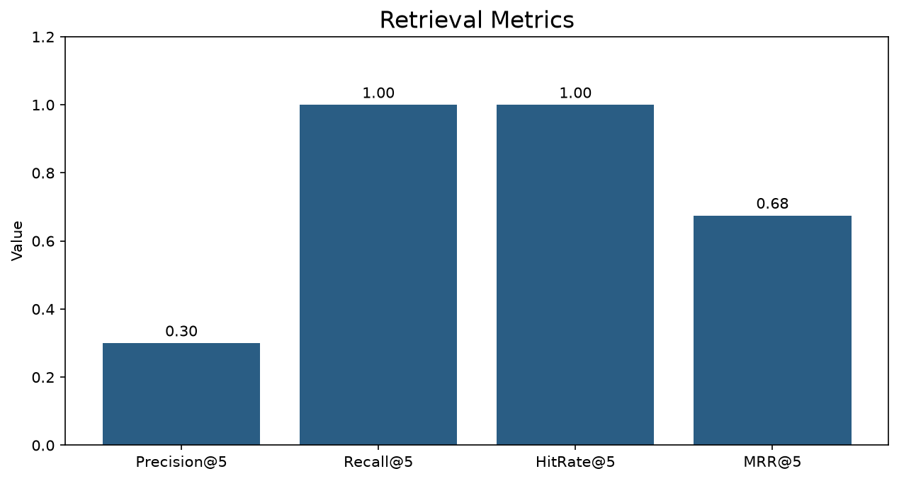
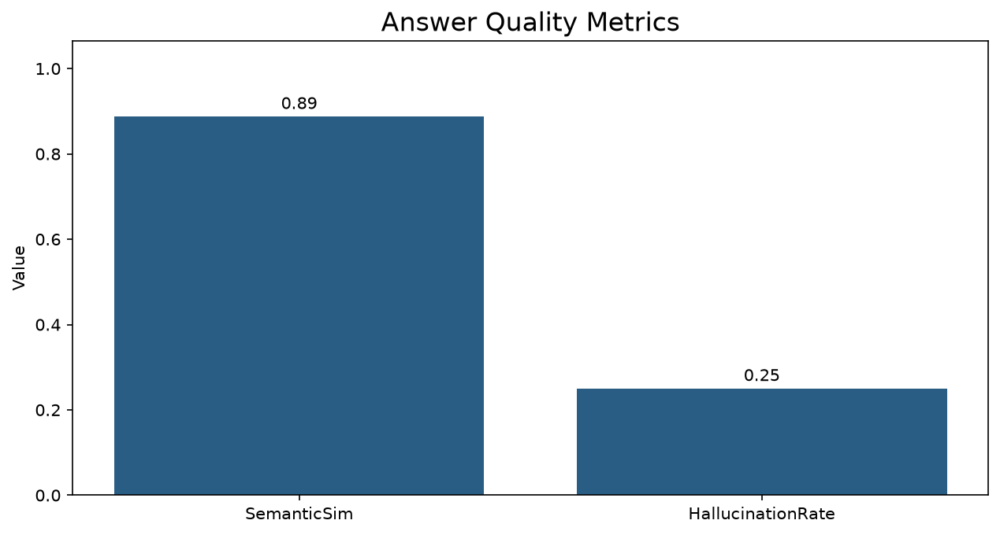
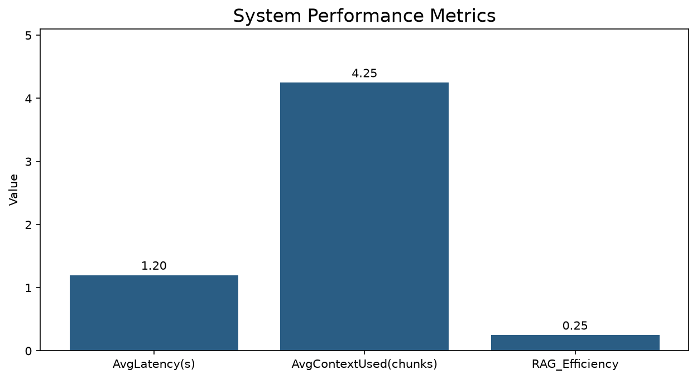

# AGRO — PDF-based RAG Q&A for Agriculture

AGRO is a lightweight Retrieval-Augmented Generation (RAG) system designed for question-answering over agricultural PDF documents. Upload manuals, guides, or reports and ask natural-language questions; the backend retrieves relevant document chunks and synthesizes concise answers using a configurable LLM.

**Key features**
- FastAPI backend with modular services in `src/`
- React + Vite frontend in `frontend/`
- Support for local models (Ollama) and cloud fallbacks (OpenAI)
- Vector retrieval + chunking pipeline and persistent vector store

**Project structure (high level)**
- `app.py` — development launcher
- `requirements.txt` — Python dependencies
- `src/` — backend code and services
- `frontend/` — UI (React + Vite)
- `data/` — uploaded documents and vector store
- `docker/` — compose and Dockerfile for local deployment
- `tests/` — unit tests

**Quickstart (development)**
1. Clone the repo:

```bash
git clone <repo-url> && cd AGRO
```

2. Create and activate a virtual environment (Windows PowerShell shown):

```powershell
python -m venv .venv
.\.venv\Scripts\Activate.ps1
```

On macOS / Linux:

```bash
python -m venv .venv
source .venv/bin/activate
```

3. Install dependencies:

```bash
python -m pip install --upgrade pip
python -m pip install -r requirements.txt
```

4. Configure environment variables (copy `.env.example` → `.env` and edit). Important values:
- `USE_LOCAL_MODEL`, `OLLAMA_URL`, `LOCAL_LLM_MODEL`, `OPENAI_API_KEY`

5. Start backend (development):

```bash
python app.py
# or
python -m uvicorn src.api.app:app --reload
```

6. Start frontend:

```bash
cd frontend
npm install
npm run dev
```

7. Open the UI at the dev server URL printed by Vite (usually `http://localhost:5173`).

**Evaluation metrics**
AGRO tracks three metric groups useful for research and engineering trade-offs. Below are concise definitions and how they are calculated in the provided evaluation script.

- **Retrieval Metrics**
  - Precision@k: fraction of top-k retrieved chunks that are relevant; averaged across queries.
  - Recall@k: fraction of the query's relevant chunks that appear in top-k; averaged across queries.
  - Hit Rate@k: fraction of queries with at least one relevant item in top-k.
  - MRR@k (Mean Reciprocal Rank): average reciprocal rank of the first relevant item in top-k.

- **Answer Quality**
  - Semantic Similarity: average semantic similarity between generated answer and reference (e.g., embedding cosine).
  - Hallucination Rate: fraction of answers manually or automatically labeled as hallucinations.

- **System Performance**
  - Avg Latency: average end-to-end response time (seconds).
  - Avg Context Used: average number of document chunks used per query.
  - RAG Efficiency: a simple proxy defined as Precision / Avg Latency (higher is better).

See `compute_and_plot_metrics.py` for concrete implementations and example data. The script computes the above metrics from per-query traces (relevances, similarities, latencies, etc.) and produces visual charts.

**Evaluation charts**
The repository includes an evaluation script that produces three charts illustrating the metric groups. Example outputs (generated by running the script) are embedded below.

Retrieval Metrics:



Answer Quality Metrics:



System Performance Metrics:



**How to reproduce the charts**
1. Ensure your virtual environment is active and dependencies installed (see Quickstart).
2. Run the metric script:

```bash
python compute_and_plot_metrics.py
```

3. Output images will be placed in `images/evaluation_metrics/`.

To use your own evaluation traces, modify the `relevances`, `total_relevants`, `similarities`, `halluc_flags`, `latencies`, and `context_counts` variables inside `compute_and_plot_metrics.py`, or refactor the script to load a CSV/JSON of per-query traces.

**Testing**
- Run unit tests with `pytest`:

```bash
python -m pytest -q
```

**Contributing**
- Open issues for bugs and feature requests.
- Send focused PRs against `main`; include tests for new functionality.

**License**
- MIT (or change as appropriate)

**Contact**
- For help, open an issue in this repository.

